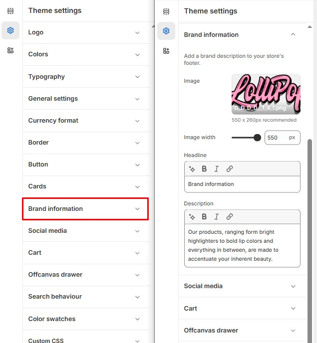

# Brand Information

The **Brand Information** section in Shopify allows you to showcase your store's branding, including your **brand name, logo, description, colors, and social media links**. This helps customers recognize and trust your brand.

> **success:** 
1. **Go to** Shopify Admin > **Online Store > Themes**.
2. Click **Customize** on your active theme.
3. In the Theme Editor, click **Theme Settings >  Brand Information**

<figure><figcaption></figcaption></figure>

#### **Brand Description**

* **Upload Image:** Add a brand-related image to enhance the section.
* **Image Width:** Adjust the display size of the image. (eg., 550px)
* **Headline:** Set a custom heading for the brand section in the footer. (Example: Brand information)&#x20;
* **Description:** Add a brief brand introduction or tagline.
  * Example: "Our products, ranging from bright highlighters to bold lip colors and everything in between, are made to accentuate your inherent beauty."
