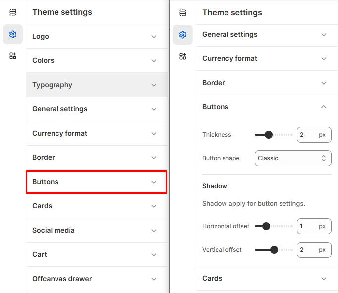

# Button

Buttons are essential elements in your Shopify store, guiding users to **add products to the cart, checkout, or explore more pages**. Shopify allows you to customize buttons to match your branding and improve user engagement.


1. **Go to** Shopify Admin > **Online Store > Themes**.
2. Click **Customize** on your active theme.
3. In the Theme Editor, click **Theme Settings > Buttons**


<figure><figcaption></figcaption></figure>

#### **Border**

* **Thickness:** Defines the border thickness for buttons.&#x20;
* **Button Shape:** Select the button style. (Options: **Classic, Modern and Default** )

#### **Shadow**

&#x20;Applies shadows to buttons  fields.

* **Horizontal Offset:** Adjusts the shadow position on the X-axis.
* **Vertical Offset:** Adjusts the shadow position on the Y-axis.&#x20;
