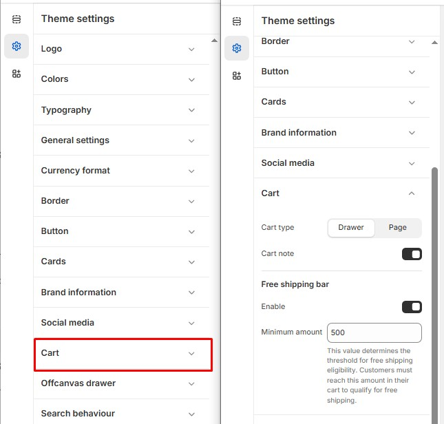

# Cart

The **Cart** in Shopify is where customers review their selected products before proceeding to checkout. You can customize the **cart page, drawer cart (side cart), cart icon, and cart behavior** to improve the shopping experience.


1. **Go to** Shopify Admin > **Online Store > Themes**.
2. Click **Customize** on your active theme.
3. In the Theme Editor, click **Theme Settings > Social Icons**.


<figure><figcaption></figcaption></figure>

#### **Cart**

* **Cart Type :** Choose the cart type Drawer / Page
  * **Drawer**: Opens the cart in a side panel without leaving the page.
  * **Page**: Redirects customers to a separate cart page.
* **Cart Note:**  Allows customers to add special instructions or notes to their order.

#### **Free Shipping Bar**

* **Enable:** Activates the free shipping progress bar.
* **Minimum Amount:** Sets the order value required for free shipping. (Default: 500)
  * Customers must reach this amount in their cart to qualify.
