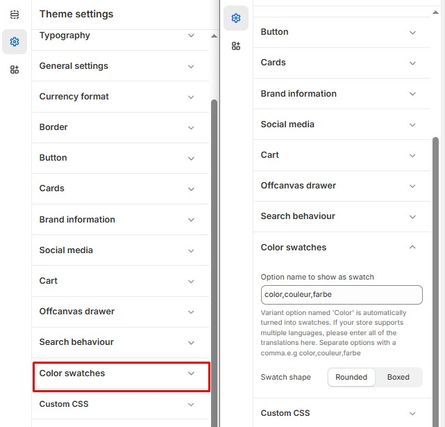

# Color Swatches

The **Color Swatches** settings allow you to customize the appearance of color-based filters in **collections and search**. These settings help customers easily identify and select products based on color options.


1. **Go to** Shopify Admin > **Online Store > Themes**.
2. Click **Customize** on your active theme.
3. In the Theme Editor, click **Theme Settings > Color Swatches**.


<figure><figcaption></figcaption></figure>

#### **Swatch Display Options**

* **Option Name to Show as Swatch:** Defines which variant options are displayed as color swatches. (eg., color,couleur,farbe)
  * If your store supports multiple languages, enter translations separated by commas (e.g., color,couleur,farbe).
  * The variant option named **"Color"** is automatically converted into swatches.

#### **Swatch Shape**

* **Rounded:** Displays swatches with rounded edges.
* **Boxed:** Displays swatches as square or rectangular boxes.
