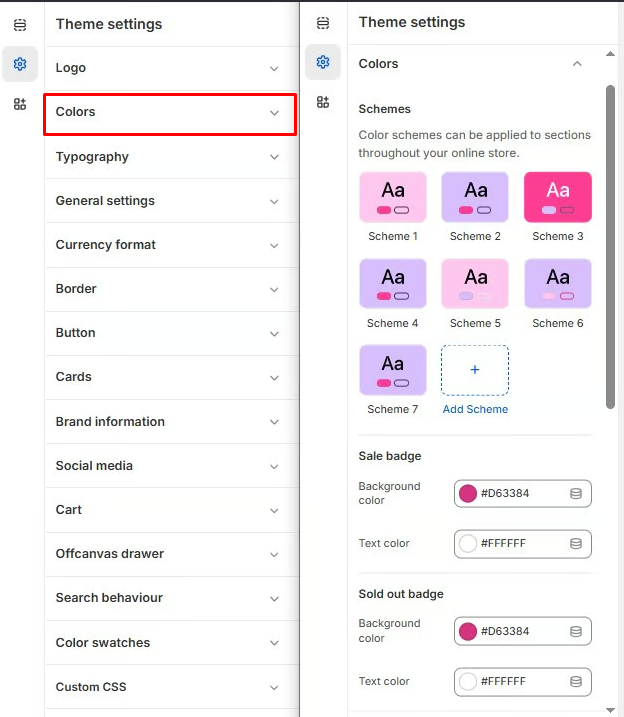

# Colors

**Color Schemes** in your theme settings allow you to create and apply a consistent visual identity across various sections of your online store. These schemes ensure that the color palette used in your site aligns with your brand identity and enhances the user experience.

> **success:** 
1. **Go to** Shopify Admin > **Online Store > Themes**.
2. Click **Customize** on your active theme.
3. In the Theme Editor, click **Theme Settings**  > **Color** from the left panel.

**Color scheme :** You can customize the theme appearance by changing the **text color, background color**, and more using preset color options.

<figure><figcaption></figcaption></figure>
