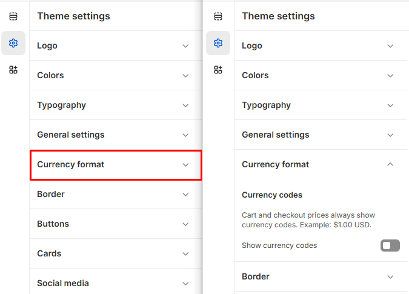

# Currency Codes

**Currency Codes** refer to the three-letter codes used to represent different currencies (e.g., **USD for US Dollar, EUR for Euro, GBP for British Pound**). These codes help display product prices in different currencies for international customers.


1. **Go to** Shopify Admin > **Online Store > Themes**.
2. Click **Customize** on your active theme.
3. In the Theme Editor, click **Theme Settings > Currency Codes.**


<figure><figcaption></figcaption></figure>

#### **Currency Codes**

* **Cart and Checkout Prices** : Prices displayed in the cart and during checkout will always include currency codes. (Example: $1.00 USD )
* **Show Currency Codes** : Enable this option to display the currency code alongside product prices throughout the store.
