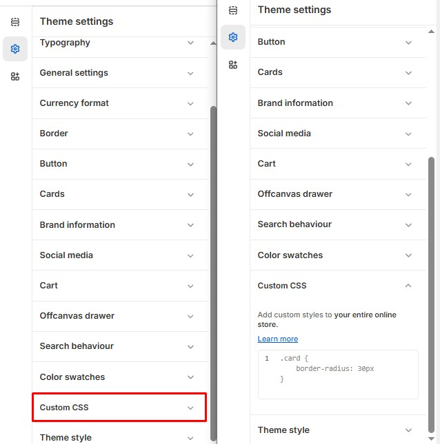

# Custom CSS

The **Custom CSS** option in Shopify's **Theme Settings** allows you to modify the **default styles** of your theme, providing greater flexibility in personalizing your store’s appearance.&#x20;

> **success:** 
1. **Go to** Shopify Admin > **Online Store > Themes**.
2. Click **Customize** on your active theme.
3. In the Theme Editor, click **Theme Settings > Custom CSS**.
4. Add your **CSS code** in the provided entry form.
5. Click **Save** to apply your changes.

By adding valid **CSS entries**, you can customize layouts, typography, colors, spacing, and other design elements

<figure><figcaption></figcaption></figure>
