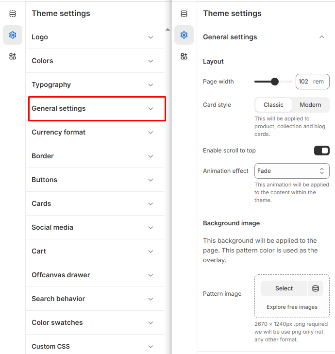

# General Settings

The **Theme Settings** section in Shopify allows you to fully customize the design and functionality of your store.


1. **Go to** Shopify Admin > **Online Store > Themes**.
2. Click **Customize** on your active theme.
3. In the Theme Editor, click **Theme Settings > General settings**.


### **General Settings**

<figure><figcaption></figcaption></figure>

**Layout** :  Adjust overall page structure.

* **Page Width**: Set the maximum width of the content container.
* **Card Style**: Choose the display style for product, collection, and blog cards:
  * **Classic :** Traditional bordered layout.
  * **Modern :** Sleek and minimal card design.
* **Enabe Scroll to Top**: Enable a floating button that lets users quickly scroll to the top of the page.
* **Animation Effect :** Choose the animation style for theme content appearance: **Fade, Fade Up, Fade Down, or None.**

**Background Settings :** Apply a custom background across the store.

* **Pattern Image**: Upload an optional overlay image to apply a pattern over the background.
