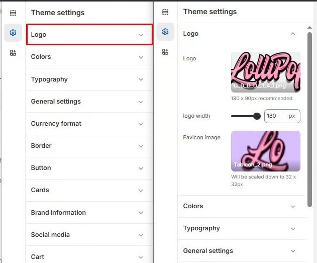

# Logo

**Logo and Favicon** settings under **Theme Settings** allow you to upload and customize your store’s **logo** (for your header and footer) and **favicon** (the small icon shown in browser tabs).

> **success:** 
1. **Go to** Shopify Admin > **Online Store > Themes**.
2. Click **Customize** on your active theme.
3. In the Theme Editor, click **Theme Settings**  > **Logo** from the left panel.

<figure><figcaption></figcaption></figure>

#### **Logo Settings**

* **Logo** : Add a custom logo for your website. Supported file formats: PNG, JPG, SVG.
* **Logo Width** : Set the width of the logo (Default: 180px). Note: The logo width is automatically optimized for mobile devices.
* **Favicon Image** : Add a favicon image to be displayed in the browser tab. Note: The uploaded image will be scaled down to **32 × 32px** for optimal display.

