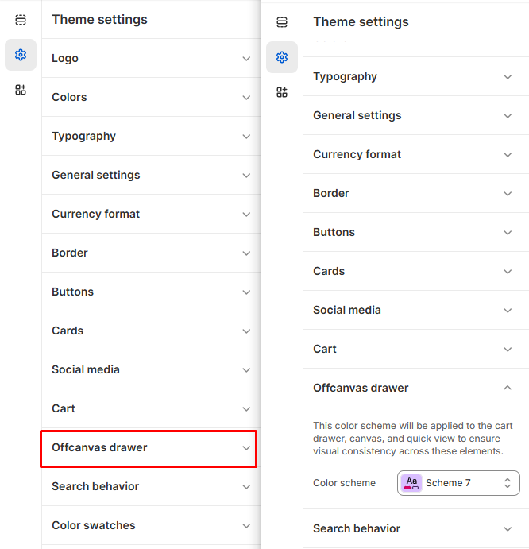

# Offcanvas Drawer

The **Offcanvas Drawer** is a hidden sliding panel used for displaying the menu, cart, or search options in a sleek, unobtrusive way. You can customize the style, color scheme, and separator style for the drawer to match your store's theme and enhance the user experience.


1. **Go to** Shopify Admin > **Online Store > Themes**.
2. Click **Customize** on your active theme.
3. In the Theme Editor, click **Theme Settings**.
4. Select **Offcanvas Drawer** to customize the settings.


<figure><figcaption></figcaption></figure>

This color scheme will be applied to the cart drawer, canvas, and quick view, ensuring visual consistency across these elements.

**Color scheme :** You can customize the theme appearance by changing the **text color, background color**, and more using preset color options.
