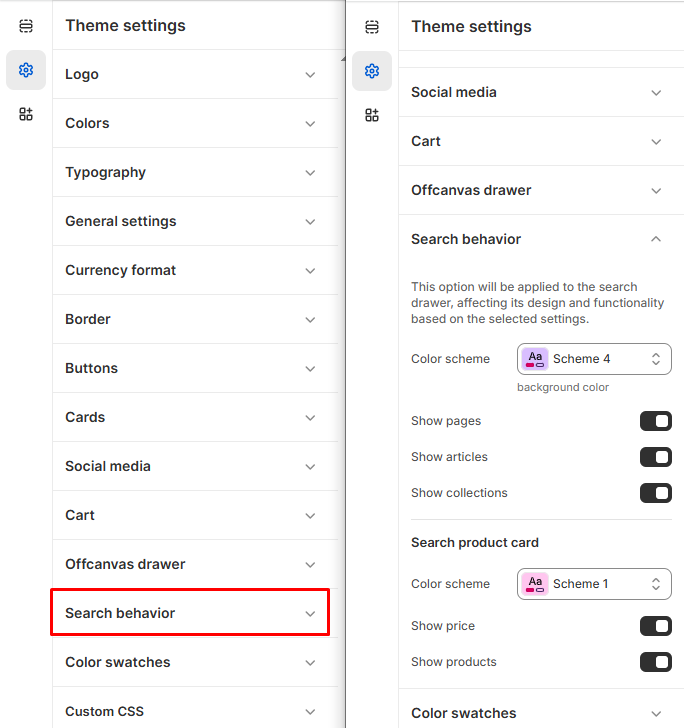

# Search behaviour

Shopify’s **search functionality** helps customers quickly find products, collections, and pages. You can customize search settings to improve results, add filters, enable predictive search, and enhance the search experience.


1. **Go to** Shopify Admin > **Online Store > Themes**.
2. Click **Customize** on your active theme.
3. In the Theme Editor, click **Theme Settings > Search behaviour**


<figure><figcaption></figcaption></figure>

This setting customizes the search drawer’s design and functionality.

#### Search behavior

* **Color scheme :** You can customize the theme appearance by changing the **text color, background color**, and more using preset color options.
* **Show Pages** : Include store pages in search results.
* **Show Articles** : Display blog articles in search results.
* **Show Collections** : Include product collections in search results.

#### **Search Product card**

* **Search Card Color:** Sets the color scheme for search result cards.&#x20;
* **Show Price** : Display product prices in search results.
* **Show Products** : Display individual products in search results.
