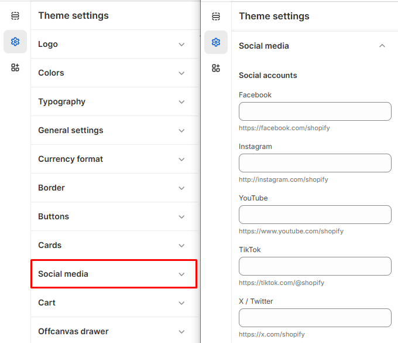

# Social Icon

The **Social Media Settings** allow you to add social icons and links to your store, making it easy for customers to connect with your brand on various platforms.


1. **Go to** Shopify Admin > **Online Store > Themes**.
2. Click **Customize** on your active theme.
3. In the Theme Editor, click **Theme Settings > Social Icons**.
4. Enter your **social media links** in the provided fields.
5. Click **Save** to apply your changes.


### **Settings & Customization**

<figure><figcaption></figcaption></figure>

**Social Icons**

* Enable **social media icons** to display in the **header, footer, or other sections** of your store.
* Icons automatically link to the accounts you set up.

**Supported Platforms**

* Facebook
* Instagram
* Twitter (X)
* Pinterest
* YouTube
* LinkedIn
* TikTok

**Adding Social Links**

* Enter the **full URL** of each social media profile to link it to the corresponding icon.
* Example: [**https://www.instagram.com/yourbrand**](https://www.instagram.com/yourbrand)

#### **Best Practices**

* Use **consistent branding** across all social platforms.
* Place icons in **visible areas** like the **header or footer** for easy access.
* Regularly update **social links** to ensure they are active and correct.
