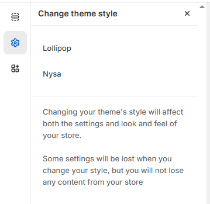

# Theme Styles


1. In the theme editor (**Customize**), click **Theme settings**
2. Locate **Theme style**
3. Make necessary changes >**Save**


A theme preset is simply a saved / pre-defined selection of theme settings that have been configured to show a particular style and appearance of theme content. Those settings would include:

* Logo
* Colors
* Typography
* General setting
* Border
* Button
* Cards
* Cart

<figure><figcaption></figcaption></figure>
