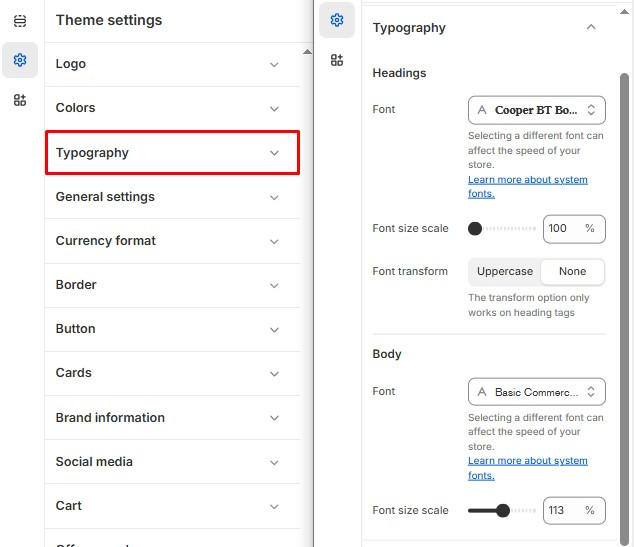

# Typography

With the Typography settings, you have the freedom to personalize the font styles, sizes, and letter casing for your entire store.


1. **Go to** Shopify Admin > **Online Store > Themes**.
2. Click **Customize** on your active theme.
3. In the Theme Editor, click **Theme Settings > Typography** .


<figure><figcaption></figcaption></figure>

**Headings**

* Configure the **font type** and **size** for all headings used in the theme.
* Choose from available font styles to match your brand identity.
* To change the default font size for heading , use the Font size scale to select the default font size. The minimum font size is 100% and the maximum font size is 125% .&#x20;

**Body**&#x20;

* The theme primarily uses the **body font** as the main font type.
* Customize the **font type** and **size** to ensure readability and consistency across your store.
* To change the default font size for body, use the Font size scale to select the default font size. The minimum font size is 100% and the maximum font size is 125% .
